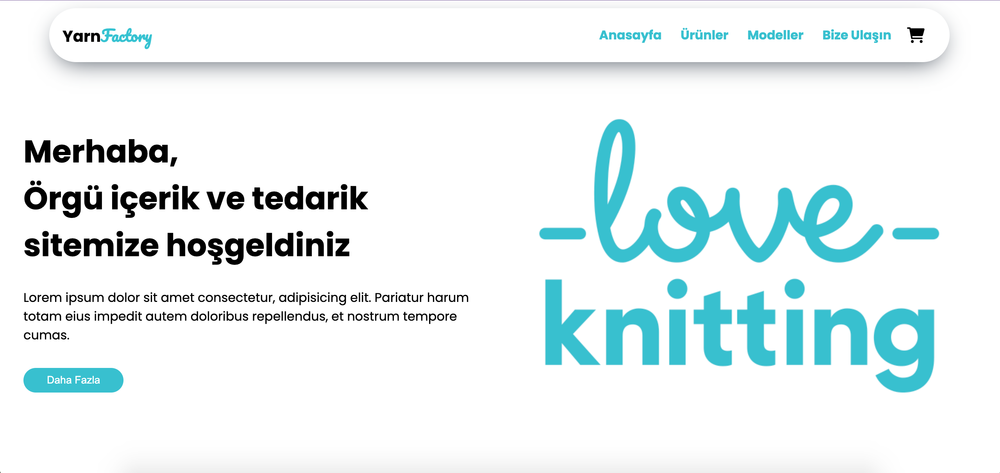

# YarnFactory Website
`YarnFactory` website is a learning purpose sketch website. For learning purposes, there are two branches;
- `vanilla` : which contains pure Html and CSS version
- `main`: which contains VueJS and Tailwindcss

## Vanilla Branch

### Aim
    - Exercise Html and CSS

### Learning/Experimenting
    - Structing html tags and styling
    - CSS Styling, Positioning, Flex etc.
    - Navigation bar and styling

## Main Branch

### Aim
    - Learn CSS styling via Tailwind CSS
    - Learn development of VueJS framework

### Learning/Experimenting
    - TBD